```text
Univerzitet u Novom Sadu
Fakultet tehničkih nauka
Računarska tehnika i računarske komunikacije
```

## Osnovi algoritama i struktura DSP 2
### Projektni zadatak 1

### Zadatak 1

Bilo je potreno koeficijente predstaviti u nepokretnom zarezu i obratiti pažnju na opseg (Int16: `-32768-32767`). Shelving koeficijente predstavljamo direktno zato što su u opsegu `[-1, 1]`, dok peek koeficijente delimo sa 2 i zatim predstavljamo.

Koeficijente računamo pomoću prenosnih funkcija allpass filtera, gde je A1 za filter prvog reda, a A2 drugo reda.

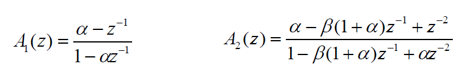

Za `alpha = 0.3`, lowpass koeficijenti su: `A0 = 29348`, `A1 = -32768`, `B0 = 32767`, `B1 = -29349`.

### Zadatak 2

Lowpass shelving filter za `alpha = 0.3`, `K = 0.25`, na impulsnu pobudu, vremenski i frekventni odziv.

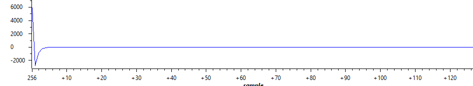

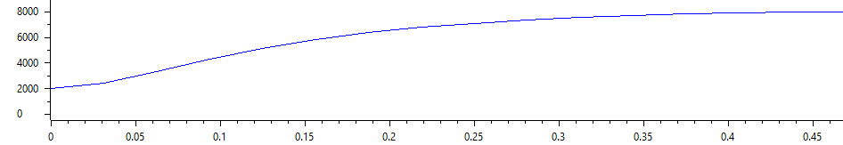

Filter je realizovan korišćenje sheme[^1].

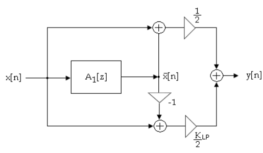

### Zadatak 3

Highpass shelving filter za `alpha = -0.3`, `K = 0.25`, na impulsnu pobudu, vremenski i frekventni odziv.

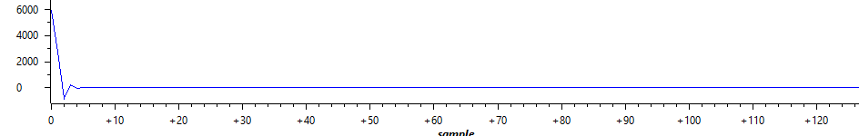

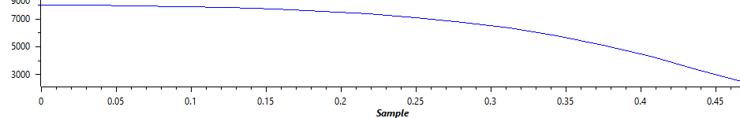

Filter je realizovan korišćenje sheme[^2].

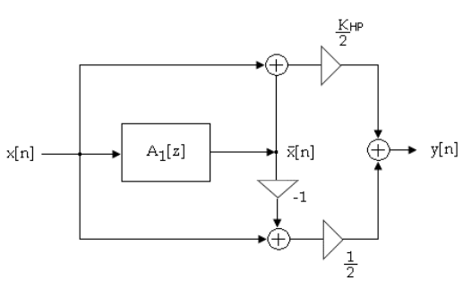

### Zadatak 4

Peek shelving filter za `alpha = 0.7`, `beta = 0`, `K = 0.25`, na impulsnu pobudu, vremenski i frekventni odziv.

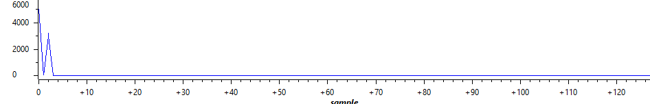

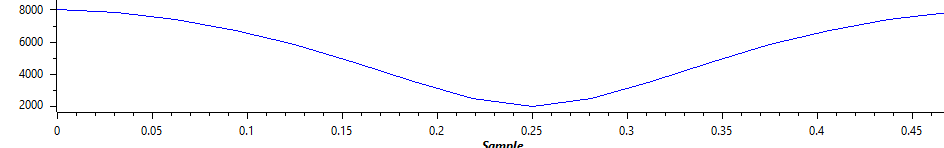

Filter je realizovan korišćenje sheme[^3].

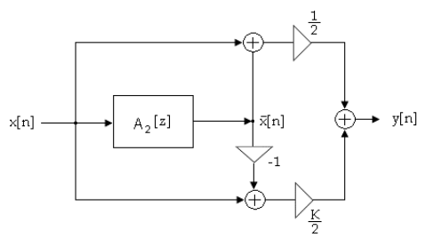

### Zadatak 2, 3, 4

Kod sva 3 zadatka zajedničko je da se izvršavaju za svaki odbirak i sadrže deljenje sa 2 i množenje sa K.

Kako bi ubrzali izvršavanje, deljenje sa 2 možemo realizovati bitwise operacijom šiftovanja za jedno mesto u desno. Za množenje možemo koristiti `_smpy` makro.

Lowpass i highpass shelving filteri koriste `first_order_iir`, a peek `second_order_iir`.

### Zadatak 5

Za impulsnu pobudu, vrednosti K kod `LP ≈ 0.25`, `Peek1 ≈ 0.75`, `Peek2 ≈ 0.1` i `HP ≈ 0.4`, vremenski i frekventni odziv.

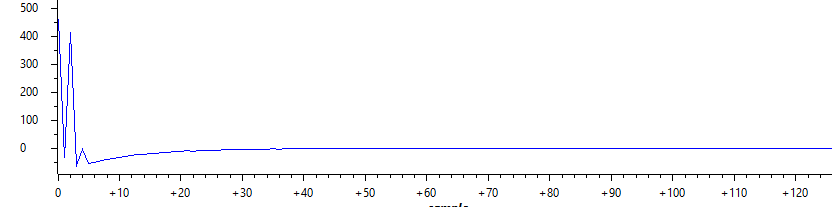

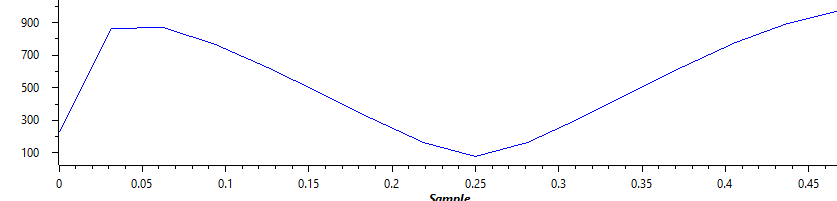

Za računanje koeficijenata potrebni su nam parametni alpha i beta. Njih smo dobili iz formula za graničnu i centralnu učestalost i širinu opsega:

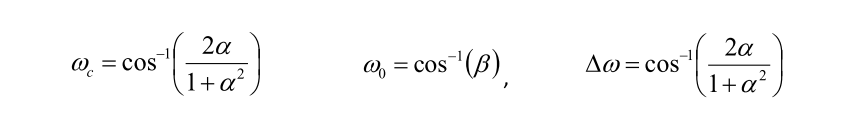

Band0 `fc = 140Hz`, Band1 `f0 = 390Hz`, Band1 `Δf = 200Hz`, Band2 `f0 = 2935Hz`, Band2 `Δf = 1905Hz` i Band3 `fc = 5500Hz`. Vrednost frekvencija su uzete iz priložene tabele `bands.pdf`.

### Zadatak 6

Preko tastera SW1 vršimo promenu filtera (podopsega) sa kojim upravljamo, a tasterom SW2 biramo vrednost K. Svakim pritiskom na SW2, vrednost K se smanjuje za 0.1. Kada dođemo do negative vrednosti za K, vraćamo K na 1.

Za ispis na displej koristimo `printChar` funkciju, a za dobavljanje pritisnutnog tastera `EZDSP5535_SAR_getKey`.

Takođe ukoliko držimo pritisnu jedan taster on će se izvršiti samo jednom, jedan klik jedan “događaj”.

[^1]: "Priprema za laboratorijske vežbe iz predmeta Osnovi algoritama i struktura DSP II - Projektovanje i realizacija jednostavnog sistema za poboljšanje audio signala", strana 2, slika 1a.

[^2]: "Priprema za laboratorijske vežbe iz predmeta Osnovi algoritama i struktura DSP II - Projektovanje i realizacija jednostavnog sistema za poboljšanje audio signala", strana 3, slika 3a.

[^3]: "Priprema za laboratorijske vežbe iz predmeta Osnovi algoritama i struktura DSP II - Projektovanje i realizacija jednostavnog sistema za poboljšanje audio signala", strana 5, slika 5a.